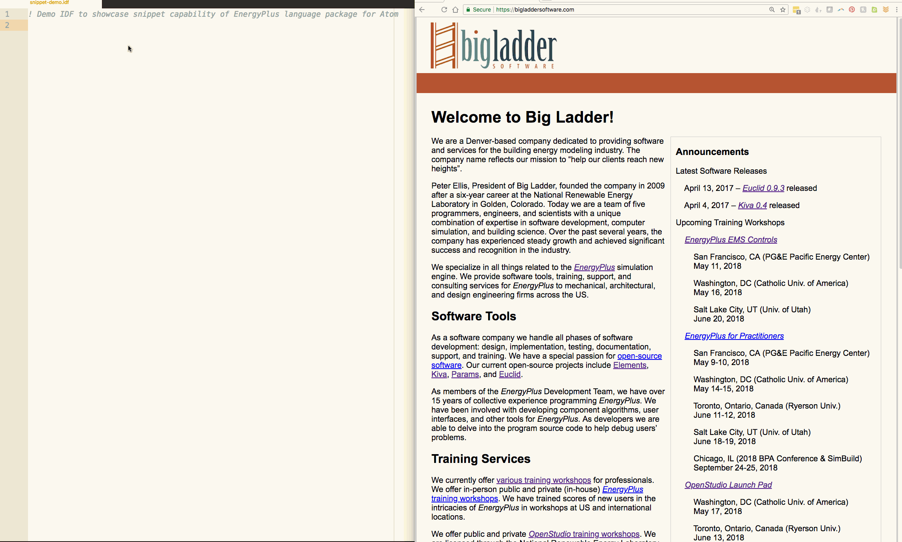

# EnergyPlus language support in Atom

Syntax highlighting and object auto-completion for EnergyPlus and Modelkit files

## Manual Installation

If the package installation process within Atom isn't working, you can install manually instead. First, save this package's folder to a local directory and **NOT** a shared directory.

Open a command window in the "atom-energyplus-package" directory you saved in the first step and type the command '[apm link](https://discuss.atom.io/t/load-developing-package/2554)'. If that doesn't work, you may need to add Atom's 'apm' to your Path variable (see below) and try the command again.

- Windows: `C:\Users\<user name>\AppData\Local\atom\app-<Atomversion>\resources\app\apm\bin`

Once 'apm link' works, you should be able to view a new folder for this package in your primary Atom packages folder (see below).

- Windows: `C:\Users\<user name>\.atom\packages`

- Mac: `Users/<user name>/.atom/packages`

## Snippets

This package leverages snippets to auto-complete EnergyPlus objects with input fields set to default values. Input fields that do not have default values and require user input are auto-completed with "???".

This package also leverages snippets to auto-complete typical code blocks used in Modelkit projects. Code block components that require user input are auto-completed with "???".

To use EnergyPlus snippets, type in the object class name, then select the appropriate object class name preceded by the green snippets arrow by clicking on it or using arrow keys to highlight the object and then hit the **Tab** or **Enter** key. At the bottom of the auto-complete window, you will be able to see a description of what that object represents in the building energy model. This description is taken from the EnergyPlus Input Data Dictionary (IDD) file. At the end of that description is a URL labeled `More ..`, which is a link to the web-based EnergyPlus Input-Output Reference documentation for that object. The gif below shows an example of using snippets to generate a `Version` and `Building` object, as well as how to access web-based documentation for the `Building` object.

To use Modelkit snippets, type in the initial characters of the code black you want to insert. Select the appropriate snippet in the auto-complete window the same way you would for an EnergyPlus snippet. Note that in order to view the Modelkit snippets beginning with "<%" in the auto-complete window, you must check the "Enable Extended Unicode Support" box in the settings for the 'autocomplete-plus' package that comes with Atom. Also note that the auto-complete window will disappear if you include "%".

## Text Color and Highlighting

This package leverages four grammar CSON files (e.g. `grammars/language-err.cson`) to define different categories of text that appear in EnergyPlus and Modelkit files using Javascript regex (regular expressions). Once those are defined, the styles LESS file (e.g. `styles/language-idf.less`) defines what text color and background highlighting formats to apply to some of those text categories. For example, EnergyPlus object class names (*keyword.object.class.idf*) appear in blue, bold text and the final line in ERR files will either have green background highlighting if the most recent simulation succeeded (*entity.warning.idf*) or red background highlighting if the most recent simulation terminated (*variable.warning.idf*). The grammar CSON files and styles LESS file can be reconfigured, if you desire.

## Toggle Comments

This package includes two commands for toggling comments: **Toggle EnergyPlus Comments** for adding and removing "! " from the beginning of lines in IDF, IMF, and PXT files, and **Toggle Modelkit Comments** for adding and removing "# " from the beginning of lines in IMF and PXT files. There are three options for accessing these commands:

- From the *Packages / Language EnergyPlus* menu
- Right-clicking within an active file
- Using keybindings (`shift-ctrl-1` for **Toggle EnergyPlus Comments** and `shift-ctrl-3` for **Toggle Modelkit Comments**)

These commands can be used for a single line or multiple selected lines. If all selected lines begin with comment characters, then the comment characters will be removed. Otherwise, the commands will add comment characters to the beginning of each selected line. This is the same behavior as the native **Toggle Comments** command in Atom found under the *Edit / Toggle Comments* menu for standard filetypes.

The keybindings are defined in `keymaps/language-idf-keymap.json` and can be reconfigured, if you desire.

## Soft Wrap

This package turns off Atom's **Soft Wrap** feature for EnergyPlus and Modelkit files by default. This can be reconfigured in `settings/language-idf.cson`, if you desire.

## Copyright

All files copyright (c) 2017-2018 Big Ladder Software. All rights reserved.

## License

See the file **LICENSE.md**.
